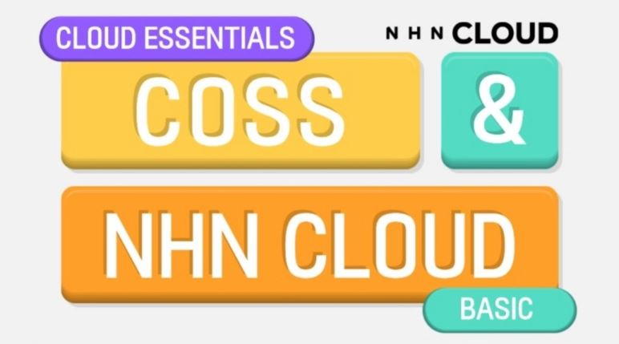
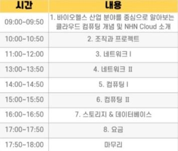
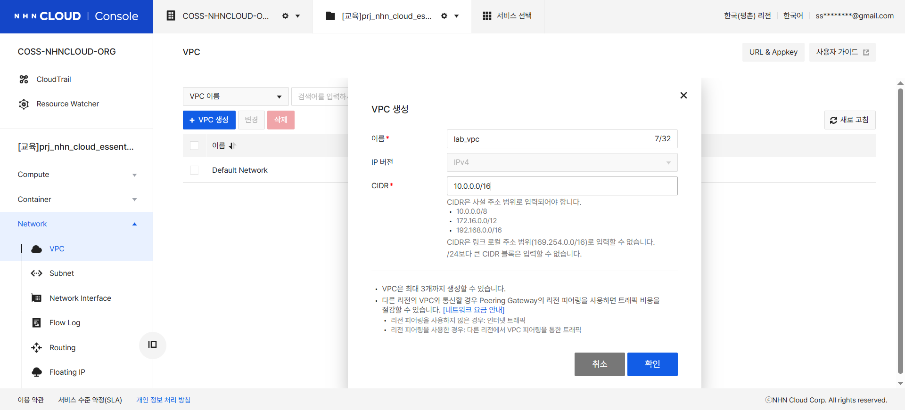
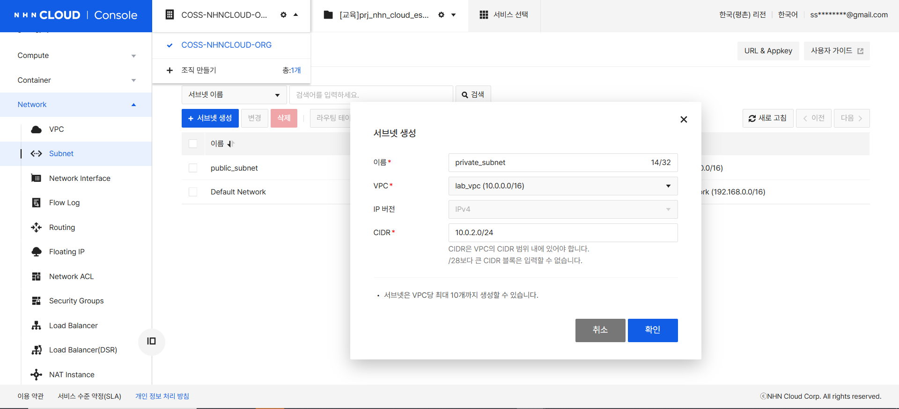
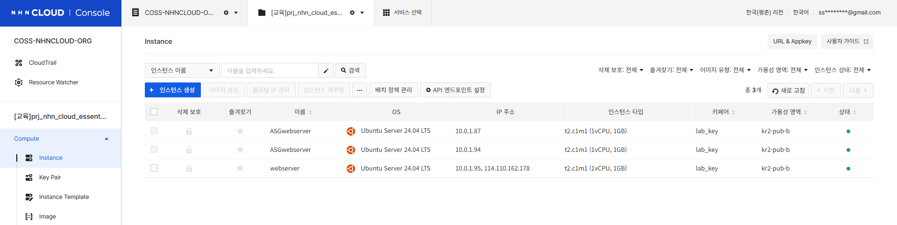
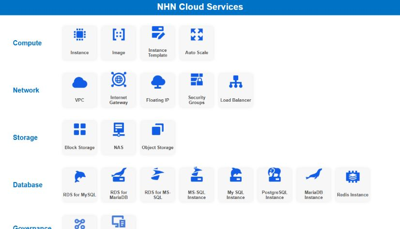
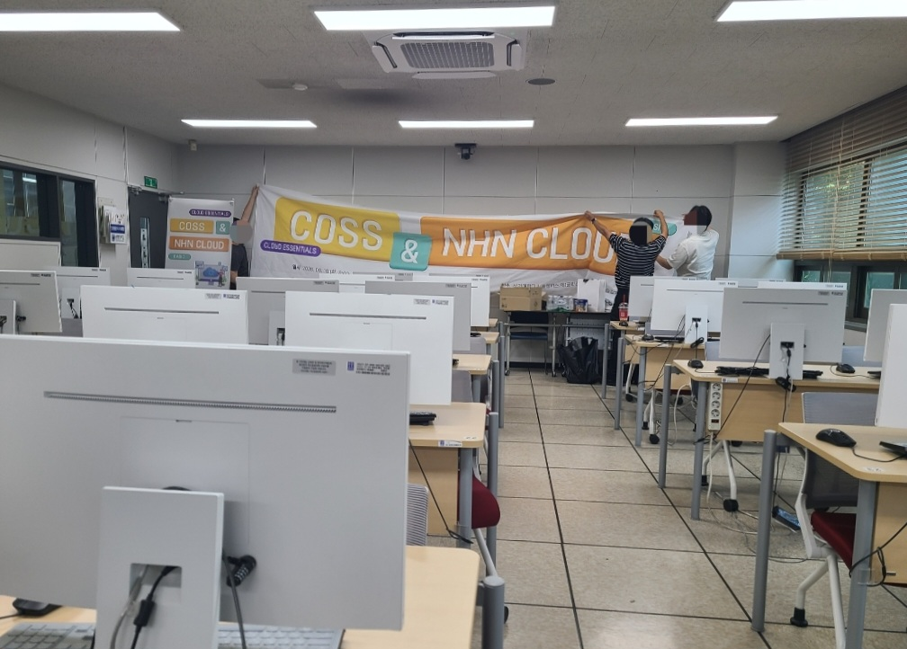

# [COSS & NHN Cloud 프로그램] NHN Cloud Training : Cloud Essentials 수강 후기

> 수강일: 2026.06.16
> 교육명: [COSS & NHN Cloud 프로그램] NHN Cloud Training : Cloud Essentials

## 요약

* VPC, Subnet, Internet Gateway, Routing Table, Floating IP가 각각 따로 존재하는 설정값이 아니라 하나의 네트워크 흐름으로 연결된다는 점을 이해할 수 있었다.
* Instance, Image, Instance Template, Load Balancer, Auto Scale을 직접 구성하며 확장 가능한 웹 서비스 아키텍처가 만들어지는 과정을 실습했다.
* 이전에는 실습 교안을 따라가는 데 집중했다면, 이번 교육에서는 궁금한 내용을 현직자분께 바로 질문하고 이해할 때까지 설명을 들을 수 있어 구조를 더 깊게 이해할 수 있었다.

## 수강 목적

기존 프로젝트를 진행하면서 AWS와 Azure를 사용해 본 경험은 있었지만, 클라우드 아키텍처를 자신 있게 설명하기는 어려웠다.
특히 VPC, Subnet, Gateway, Routing Table, Floating IP 같은 네트워크 구성 요소는 콘솔에서 설정한 적은 있어도, 왜 그렇게 연결해야 하는지까지 명확하게 이해하고 있지는 못했다.

이번 NHN Cloud Training : Cloud Essentials 교육은 네트워크 환경 구성부터 웹서버 생성, Load Balancer와 Auto Scale 구성, RDS for MySQL, Object Storage 사용까지 하나의 흐름으로 직접 실습할 수 있는 과정이어서 참여하게 되었다.

<em>세부 일정</em>

## 가장 성장한 점: 네트워크를 ‘설정값’이 아니라 ‘흐름’으로 이해하기

가장 도움이 되었던 부분은 네트워크 구성이었다.
이전에는 `0.0.0.0/0`, `/16`, `/24` 같은 값을 설정값으로만 입력하고 넘어가는 경우가 많았다. 하지만 이번 교육에서는 VPC를 큰 네트워크 공간으로 잡고, 그 안에서 Public Subnet과 Private Subnet을 나눈 뒤, Internet Gateway와 Routing Table을 통해 외부 접근 가능 여부가 결정되는 흐름을 이해할 수 있었다.

특히 Public Subnet에는 외부 접근이 필요한 웹서버를 배치하고, Private Subnet에는 RDS for MySQL과 같은 데이터베이스를 배치하는 구조를 직접 구성하면서 보안 관점의 아키텍처도 함께 이해할 수 있었다.
단순히 “DB는 Private Subnet에 둔다”라고 외우는 것이 아니라, 왜 데이터베이스를 외부에 직접 노출하지 않는지, 웹서버와 DB가 어떤 경로로 통신하는지 생각해 볼 수 있었다.

## 실습하며 인상 깊었던 서비스

### NHN Cloud Instance

NHN Cloud Instance를 통해 웹서버를 생성하고, 사용자 스크립트를 이용해 초기 환경을 구성했다. 이후 생성된 웹서버를 Image로 만들고, 이를 Instance Template과 Auto Scale 구성에 활용하면서 서버 이미지를 재사용하는 흐름을 이해할 수 있었다.

이 과정에서 Image가 단순한 백업이 아니라, 동일한 환경의 서버를 반복 생성하기 위한 템플릿 역할을 한다는 점이 인상 깊었다.

### NHN Cloud Load Balancer와 Auto Scale

Load Balancer와 Auto Scale 실습도 인상 깊었다.
Load Balancer를 생성하고 Scaling Group과 연결한 뒤, 여러 인스턴스가 트래픽을 나누어 처리하는 구조를 확인했다. 특히 새로고침할 때마다 현재 웹 서버의 Private IP가 바뀌는 것을 보면서, Load Balancer가 실제로 요청을 여러 서버에 분산한다는 점을 직관적으로 이해할 수 있었다.

또한 Auto Scale 정책을 설정하면서 확장 가능한 아키텍처가 단순히 서버를 여러 대 만드는 것이 아니라, 부하 조건, 최소·최대 인스턴스 수, Load Balancer 연결까지 함께 설계해야 한다는 점을 배웠다.

### NHN Cloud RDS for MySQL

RDS for MySQL을 Private Subnet에 생성하고, 웹서버를 통해 데이터베이스에 접속하는 실습도 기억에 남았다.
웹서버는 외부에서 접근 가능하지만, 데이터베이스는 외부에 직접 노출하지 않는 구조를 직접 만들어 보면서 클라우드 보안 설계의 기본 원리를 이해할 수 있었다.

기존에는 RDS를 “클라우드에서 쓰는 DB” 정도로만 이해했다면, 이번에는 RDS가 어느 Subnet에 위치해야 하는지, 어떤 보안 그룹 규칙이 필요한지, 웹서버와 어떻게 연결되는지를 함께 고민할 수 있었다.

### NHN Cloud Object Storage

Object Storage에서는 컨테이너를 생성하고 정적 웹사이트를 구성해 보았다.
서버를 따로 구성하지 않아도 정적 파일을 업로드하고 URL로 접근할 수 있다는 점에서, 웹 서비스에서 정적 리소스를 분리해 관리하는 방식을 이해할 수 있었다.

또한 PUBLIC과 PRIVATE 접근 정책의 차이를 직접 설정해 보면서, 파일을 외부에 공개해야 하는 경우와 보호해야 하는 경우를 구분하는 것이 중요하다는 점도 알 수 있었다.

## 기존 실습과 달랐던 점

이전에는 클라우드 실습을 할 때 교안을 보고 순서대로 따라가는 데 집중하는 경우가 많았다.
그러다 보니 화면은 완성되었지만, 왜 이 설정을 하는지, 이 값이 바뀌면 어떤 영향이 생기는지까지는 충분히 이해하지 못한 채 넘어가기도 했다.

이번 특강에서는 실습 중 궁금한 내용을 바로 현직자분께 질문할 수 있었고, 이해할 때까지 친절하게 설명해 주셔서 좋았다.
예를 들어 CIDR 범위, 게이트웨이 역할, Floating IP와 Private IP의 차이, Load Balancer가 트래픽을 분산하는 방식처럼 혼자 실습할 때는 애매하게 넘어갔던 부분을 구체적인 사례로 설명해 주셔서 훨씬 명확하게 정리할 수 있었다.

## NHN Cloud를 사용하며 느낀 점

기존에는 AWS와 Azure를 사용해 본 경험이 있었는데, NHN Cloud 콘솔은 실습 과정에서 메뉴를 따라가기 비교적 편했다.
VPC, Subnet, Instance, Floating IP, Load Balancer 등 관련 서비스가 직관적으로 배치되어 있어 실습 흐름을 놓치지 않고 따라갈 수 있었다.

또한 교육 중 UI 개선 계획에 대한 이야기도 들을 수 있었는데, 이미 실습 과정에서 사용성이 괜찮다고 느낀 상태에서 앞으로 더 개선될 예정이라는 점이 인상적이었다.

## 비용 관점 인사이트

클라우드를 사용할 때 요금표를 보면서도 정확히 어떤 리소스가 비용에 영향을 주는지 막연하게 느꼈다.
이번 교육에서는 Instance, Floating IP, Load Balancer, RDS for MySQL, Object Storage처럼 실제로 생성한 리소스를 기준으로 비용이 발생하는 구조를 함께 생각해 볼 수 있었다.

특히 실습 후 리소스를 삭제하는 과정까지 포함되어 있어서, 클라우드는 “만드는 것”만큼이나 “사용하지 않는 리소스를 정리하는 것”도 중요하다는 점을 체감했다. 앞으로 프로젝트를 설계할 때도 기능 구현뿐 아니라 비용을 줄일 수 있는 구조인지 함께 고민해야겠다고 느꼈다.

## 앞으로의 활용 계획

이번 교육을 통해 클라우드 아키텍처를 조금 더 자신 있게 그릴 수 있을 것 같다.
이전에는 프로젝트 발표나 보고서에서 아키텍처 다이어그램을 만들 때 어떤 서비스를 어디에 배치해야 할지 막막했다. 하지만 이제는 Public Subnet과 Private Subnet을 나누고, 웹서버 앞단에 Load Balancer를 배치하며, 데이터베이스는 Private Subnet에 두는 기본 구조를 설명할 수 있게 되었다.

앞으로 웹 서비스나 데이터 기반 프로젝트를 진행할 때 NHN Cloud의 Instance, VPC, Load Balancer, RDS for MySQL, Object Storage를 활용해 더 안정적이고 설명 가능한 아키텍처를 설계해 보고 싶다.

## Q&A

### Q. 클라우드 초보자도 들을 수 있나요?

가능하다고 생각한다. 개념 설명 후 바로 실습으로 이어져서 처음에는 낯선 용어가 많더라도 직접 구성하면서 이해할 수 있었다. 특히 VPC, Subnet, Gateway처럼 추상적으로 느껴지는 개념을 쉬운 사례와 함께 설명해 주셔서 따라가기 좋았다.

### Q. 가장 도움이 된 부분은 무엇인가요?

네트워크와 아키텍처 설계에 대한 이해가 가장 도움이 되었다. 단순히 서버를 만드는 것이 아니라, VPC, Subnet, Routing Table, Internet Gateway, Load Balancer, Auto Scale, RDS for MySQL이 하나의 서비스 구조 안에서 어떻게 연결되는지 이해할 수 있었다.

### Q. 추천하고 싶은 사람은 누구인가요?

클라우드 서비스를 사용해 본 적은 있지만, 아키텍처 구조를 정확히 설명하기 어려웠던 사람에게 추천하고 싶다. 특히 프로젝트에서 웹서버, 데이터베이스, 스토리지, 로드밸런서 구성을 직접 설계해야 하는 학생이나 초급 개발자에게 도움이 될 것 같다.

